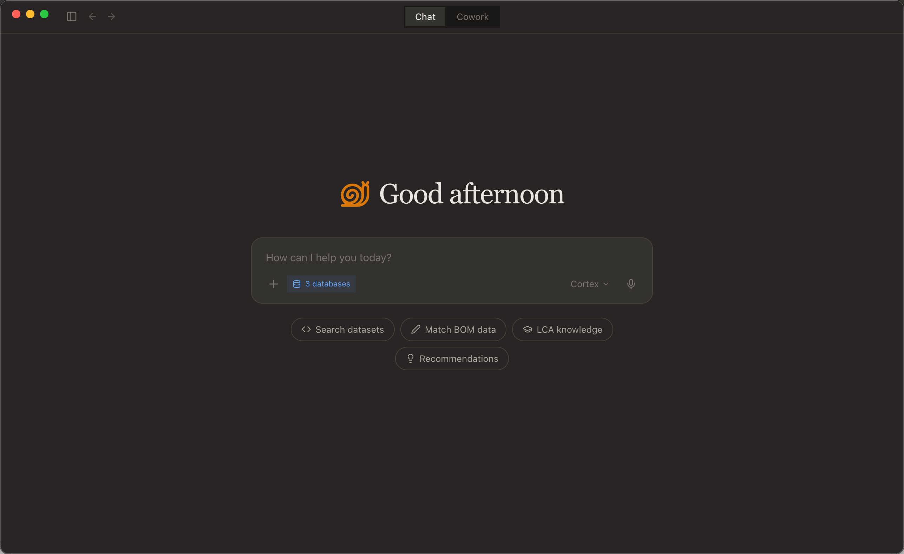

  

<h1 align="center">HiQ Cortex</h1>

  <strong>AI-Powered LCA Data Workbench</strong> 
  Search carbon footprint datasets · Match BOM background data · Analyze locally with full privacy

  
  
  

  <a href="./README_CN.md">中文</a> · English

---

## What is HiQ Cortex?

HiQ Cortex is a desktop AI assistant for Life Cycle Assessment (LCA) professionals. It connects to **12 major LCA databases** with **1,000,000+ emission factor records** and helps you find the right carbon footprint data, match background datasets for your BOM, and analyze data — all through natural language.

Built by [HiQ (海科数据)](https://www.hiqlcd.com), a Shanghai-based LCA data company operating the **HiQLCD** platform — China's leading localized LCA database covering 25+ industries with ISO 14040/14044/14067 compliant data. HiQ serves **100+ enterprise clients** across automotive, electronics, packaging, construction, and chemical industries, with **18+ strategic partners** including Tsinghua, Tongji, and Fudan universities.

  

---

You have a BOM with 31 materials. Each one needs a carbon footprint emission factor. You open SimaPro, search "carbon steel" — 200 results. Which one? You try openLCA, different database, different names. You check a spreadsheet your colleague made last year. Three hours later, you've matched 8 materials.

**Cortex does it in 3 minutes.** Tell it what you need in plain language. It searches 12 databases, asks you when it's unsure, verifies every result, and hands you a color-coded Excel with professional commentary.

---

## Quick Start

1. **Download & Install** — Grab the installer for your platform below
2. **Log in** — Use your HiQ account (request access if you don't have one)
3. **Pick your databases** — Select which LCA databases to search (bottom of input box)
4. **Ask anything** — Type "查硅钢的碳足迹数据" or "Find emission factors for PET packaging"

That's it. Cortex handles the rest — loading search skills, asking clarifying questions, verifying results.

---

## Two Modes, One App

### Chat — Cloud-Powered LCA Q&A
Quick Q&A with a professional AI carbon consultant backed by cloud intelligence:
- **Cloud conversation memory** — pick up where you left off, AI remembers your context
- **Expert knowledge base** — LCA methodology, standards, industry best practices built in
- Search across all databases, compare data sources, get methodology explanations

Like having a senior LCA analyst who never forgets and knows every standard.

### Cowork — Local-First AI Workbench
AI works directly with your local files. Everything except AI reasoning and database search runs on your machine:
- **Files stay local** — AI reads, writes, and edits files on your computer, never uploaded
- **File upload** — Attach Excel, CSV, PDF, Word, images — AI reads them with full context
- **Local execution** — Python, shell commands, data processing all run locally
- **Local storage** — conversation history, projects, workspace files stored on your device
- **Skills system** — extensible via [marketplace](https://github.com/HiQ-AI/cortex-skills) or custom .skill imports
- Autonomously plans work, delegates subtasks, parallelizes searches

Like a senior consultant sitting next to you — with their own toolkit, working on your files, on your machine.

**Chat is asking a colleague a question. Cowork is sitting down and working together on a deliverable.**

---

## What Cortex Does (and Doesn't Do)

Cortex is **not** an LCA modeling tool. It doesn't replace SimaPro, GaBi, or openLCA — it works alongside them.

| Cortex Does | LCA Tools Do |
|---|---|
| Search & match background emission factors | Product system modeling |
| Parse your BOM and recommend datasets | Carbon footprint calculation |
| Generate import-ready files for LCA tools | Impact assessment (LCIA) |
| Analyze and explain LCA tool outputs | Allocation & system boundary |
| Compare data across 12 databases | Sensitivity & uncertainty analysis |

**Think of Cortex as the data prep assistant that makes your LCA tool work faster.** It handles the tedious part — finding the right data — so you can focus on the analysis.

---

## How It Works

### Search Across 12 Databases

| Database | Coverage |
|---|---|
| HiQLCD | China-focused, 25+ industries |
| Ecoinvent | Global, most comprehensive |
| EF | EU Product Environmental Footprint |
| TianGong | Chinese national LCA database |
| CarbonMinds | Chemicals & plastics |
| Agri-footprint | Agriculture & food |
| WorldSteel | Steel industry |
| + 5 more | USDA, EXIOBASE, OZLCI, NEEDS, ELCD |

> Total: **1,000,000+** emission factor records. Search returns results in 1-3 seconds with GWP values, data quality scores, and direct links to dataset details.

### Professional Search Skills
Cortex doesn't just keyword-search. It applies professional LCA search strategies:
- **Material decomposition** — "tea packaging" becomes tinplate + cardboard + plastic liner, searched separately
- **Bilingual coverage** — searches both Chinese and English synonyms to cover more databases
- **Clarification before search** — "search steel data" triggers a question: "What kind? Carbon steel, stainless, silicon, alloy?"
- **Two-stage verification** — finds candidates first, fetches full details before showing you anything
- **Professional commentary** — explains process compatibility, regional fit, and data quality for each result

### Project Management
- Create projects with dedicated folders, instructions, and persistent memory
- AI remembers what you discussed in each project across sessions
- Set project-specific instructions (e.g., "this project uses EF 3.1 database" or "reply in English")

### Human-in-the-Loop
When the AI needs your judgment — ambiguous material names, multiple candidate datasets, missing parameters — it pauses and asks you with clickable buttons instead of guessing.

### Full Transparency
Every tool call, search query, and intermediate step appears inline in the conversation as it happens. You see what the AI is searching for, what parameters it's using, and how long each step takes.

---

## Privacy & Security: AI Comes to Your Data

Cortex is designed with a strict separation between cloud intelligence and local data. Your proprietary files, BOM data, and project information **never leave your device**.

|  | Cloud | Your Computer | Mode |
|---|---|---|---|
| AI Reasoning & Planning | ✅ | | Both |
| LCA Database Search | ✅ | | Both |
| Conversation Memory | ✅ | | Chat |
| Expert Knowledge Base | ✅ | | Chat |
| Conversation History | | ✅ | Cowork |
| File Read / Write / Edit | | ✅ | Cowork |
| Python / Shell Execution | | ✅ | Cowork |
| BOM & Project Files | | ✅ | Cowork |
| Workspace & Session Data | | ✅ | Cowork |

**Why this matters for enterprise users:**
- Your BOM data, supplier information, and product specs are never uploaded to any server
- Cowork conversation history is stored in local files on your machine, not in a cloud database
- File operations (reading Excel, writing reports, running Python) execute entirely on your computer
- The AI only sees the content you explicitly share in conversation — it cannot scan your filesystem

> **AI comes to your data. Your data doesn't go to AI.**

---

## Download

| Platform | Download |
|---|---|
| **macOS** (Apple Silicon) | [Cortex.dmg](https://github.com/HiQ-AI/cortex-desktop/releases/latest) |
| **Windows** (x64) | [Cortex-Setup.exe](https://github.com/HiQ-AI/cortex-desktop/releases/latest) |
| **Linux** (x64) | [Cortex.AppImage](https://github.com/HiQ-AI/cortex-desktop/releases/latest) |

Auto-update is built in — you'll be notified when new versions are available.

> **Important**: Cortex is not code-signed yet (Apple notarization and Windows signing are in progress). Your OS may warn you about an unrecognized developer — this is expected for beta software.

> **macOS first launch**: Right-click the app → "Open" → click "Open" in the dialog. Only needed once.

> **Windows first launch**: Windows Defender SmartScreen may show "Windows protected your PC". Click "More info" → "Run anyway". You may also need to install [Git for Windows](https://git-scm.com) — Cortex will prompt you if it's missing. No extra configuration needed after installing.

> **Note**: HiQ Cortex is in closed beta. To request access, [email us](mailto:info@hiqlcd.com) or [open an issue](https://github.com/HiQ-AI/cortex-desktop/issues/new).

---

## Use Cases

### For LCA Analysts
- "Find emission factor for 304 stainless steel in Ecoinvent 3.12" → 5 verified datasets in 3 seconds, with GWP values ranging 1.8–3.2 kg CO₂e/kg
- "Match my BOM with background datasets" → Upload Excel with 31 materials, get a color-coded result file with improvement notes
- "Compare PET data across HiQLCD and Ecoinvent" → Side-by-side comparison with regional fit analysis

### For ESG & Sustainability Teams
- Batch-match BOM materials for Scope 3 reporting — 31 materials matched in one conversation
- Export structured results ready to import into SimaPro, GaBi, or openLCA
- Generate comparison reports that explain data source selection rationale

### For Supply Chain Managers
- Upload supplier BOMs and get emission factor recommendations with professional commentary
- Evaluate materials across China, Europe, and global average datasets
- Get actionable reports that non-LCA colleagues can understand

---

## Roadmap

### Available Now
- [x] Multi-database search (12 databases, 1M+ records)
- [x] AI material analysis and dataset recommendations
- [x] Data source selection and filtering
- [x] BOM upload and batch material matching with parallel search
- [x] File upload — attach Excel, CSV, PDF, Word, images to conversations
- [x] Local file analysis with Python environment
- [x] AI autonomous task planning and subtask delegation
- [x] Human-in-the-loop interactive clarification
- [x] Multi-turn conversation with context memory
- [x] Project management with folders, instructions, and memory
- [x] Session management (star, archive, rename, search)
- [x] Skills Center — enable/disable skills, card-based UI
- [x] Skills Marketplace — cloud-based skill store, one-click install from [cortex-skills](https://github.com/HiQ-AI/cortex-skills)
- [x] Custom skill import — upload .skill/.zip files with validation
- [x] Built-in LCA search skills with bilingual keyword strategy
- [x] Real-time tool execution visibility (inline in conversation)
- [x] Code syntax highlighting
- [x] Export to CSV / Excel
- [x] Cross-platform: macOS, Windows, Linux
- [x] Auto-update
- [x] Chinese + English bilingual interface
- [x] Local-first privacy architecture

### Coming Soon
- [ ] Data visualization and comparison charts
- [ ] PDF report generation (ISO 14067 format)
- [ ] LCA tool import file generation (SimaPro CSV, openLCA JSON-LD)
- [ ] Team collaboration and shared workspaces
- [ ] Offline mode with local data cache

---

## About HiQ

[HiQ (海科数据)](https://www.hiqlcd.com) is a Shanghai-based company specializing in Life Cycle Assessment data and services. Founded by a team of LCA experts and engineers, HiQ addresses the critical need for high-quality, region-specific environmental data in China — the world's largest manufacturing economy.

- **100+** enterprise clients
- **18+** strategic partners (Tsinghua, Tongji, Fudan, and more)
- **ISO 14040 / 14044 / 14067** compliant data
- **30+** team members

---

## Feedback

- **Bug reports & feature requests** — [Open an issue](https://github.com/HiQ-AI/cortex-desktop/issues/new)
- **Questions & discussions** — [Join the discussion](https://github.com/HiQ-AI/cortex-desktop/discussions)
- **Business inquiries** — [info@hiqlcd.com](mailto:info@hiqlcd.com)

---

## License

Copyright © 2026 Shanghai HiQ Smart Data Technology Co., Ltd. (上海海科智慧数据科技有限公司). All rights reserved.

This software is proprietary. Unauthorized copying, modification, distribution, or use is strictly prohibited.

---

  Built with ❤️ by <a href="https://www.hiqlcd.com">HiQ AI</a> in Shanghai

