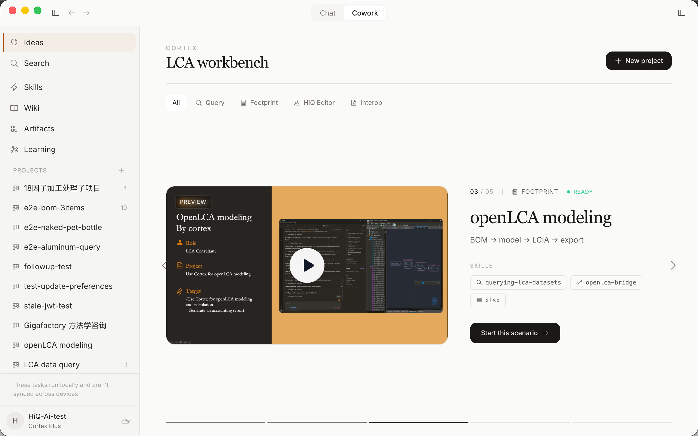

  

<h1 align="center">HiQ Cortex</h1>

  <strong>AI 驱动的 LCA 数据工作台</strong> 
  搜索碳足迹数据集 · 匹配 BOM 背景数据 · 本地分析，隐私无忧

  
  
  

  中文 · <a href="./README.md">English</a>

---

## HiQ Cortex 是什么？

HiQ Cortex 是一款面向生命周期评估（LCA）专业人士的桌面 AI 助手。它接入了 **12 个主流 LCA 数据库**，覆盖 **100 万+ 条排放因子数据**，帮你快速检索碳足迹数据、匹配 BOM 背景数据、分析和导出报告——全部通过自然语言完成。

由 [海科数据 (HiQ)](https://www.hiqlcd.com) 开发，运营中国领先的本土化 LCA 数据库平台 **HiQLCD**，覆盖 25+ 行业，数据符合 ISO 14040/14044/14067 标准。海科服务于汽车、电子、包装、建筑、化工等行业的 **100+ 家企业客户**，拥有清华大学、同济大学、复旦大学等 **18+ 家战略合作伙伴**。

---

## 快速上手

1. **下载安装** — 在下方选择你的平台下载
2. **登录** — 使用你的 HiQ 账号（没有的话可以申请试用）
3. **选数据库** — 在输入框底部选择要搜索的 LCA 数据库
4. **开始提问** — 输入"查硅钢的碳足迹数据"或"帮我把这份 BOM 匹配背景数据"

就这么简单。Cortex 会自动加载搜索技能、提出澄清问题、验证搜索结果。

---

## 两种模式，一个应用

### Chat — 云端智能 LCA 问答

  

与一位云端专业 AI 碳咨询师对话，享受完整的云端能力：
- **云端对话记忆** — 随时接续上次对话，AI 记得你聊过什么
- **专家知识库** — 内置 LCA 方法论、标准解读、行业最佳实践
- 跨库搜索、对比数据源、解释方法论差异

就像身边有一位从不忘事、熟读所有标准的资深 LCA 分析师。

### Cowork — 本地优先的 AI 工作台

  

AI 直接在你的电脑上干活，自带一整套工具箱：
- **场景剧本** — 常见 LCA 工作流一键启动（openLCA 建模、BOM 匹配、碳足迹报告），每张卡片预设角色、目标和技能组合
- **全部本地运行** — 读写编辑文件、执行 Python 与 Shell、直接拖入 Excel / CSV / PDF / Word / 图片，对话记录留在你自己的电脑上
- **项目记忆** — 每个项目都有一份 AI 自己维护的 `Cortex.md`，跨会话记住你的习惯与规范
- **知识图谱 Wiki** — 以实体图连接数据集、决策、参考资料，跨项目可查；支持列表视图与力导向图视图
- **子代理并行** — 把子任务派发给并行运行的子代理，嵌套时间线实时可见
- **技能系统** — 通过[技能市场](https://github.com/HiQ-AI/cortex-skills)或自定义 `.skill` 文件扩展能力
- **桌面自动化** — 需要时让 Cortex 操作其他桌面应用，按应用粒度授权

就像一位资深顾问坐在你旁边——用他自己的工具箱，在你的电脑上，操作你的文件。

**Chat 是问同事一个问题，Cowork 是和同事坐下来一起出活儿。**

---

## Cortex 做什么（不做什么）

Cortex **不是** LCA 建模工具。它不替代 SimaPro、GaBi 或 openLCA——它和这些工具配合使用。

| Cortex 做的事 | LCA 工具做的事 |
|---|---|
| 搜索和匹配背景排放因子 | 产品系统建模 |
| 解析你的 BOM 并推荐数据集 | 碳足迹核算 |
| 生成 LCA 工具可导入的文件 | 影响评价 (LCIA) |
| 分析和解读 LCA 工具的输出结果 | 分配与系统边界设定 |
| 跨 12 个数据库对比数据 | 敏感性与不确定性分析 |

**Cortex 是数据准备助手，让你的 LCA 工具跑得更快。** 它处理最繁琐的部分——找到对的数据——让你专注于分析本身。

---

## 它怎么工作

### 12 个数据库一站式搜索

| 数据库 | 覆盖范围 |
|---|---|
| HiQLCD | 中国本土，25+ 行业 |
| Ecoinvent | 全球最全面 |
| EF | 欧盟产品环境足迹 |
| 天工 (TianGong) | 中国国家级 LCA 数据库 |
| CarbonMinds | 化工与塑料 |
| Agri-footprint | 农业与食品 |
| WorldSteel | 钢铁行业 |
| + 5 个 | USDA, EXIOBASE, OZLCI, NEEDS, ELCD |

> 总计 **100 万+** 条排放因子数据。搜索 1-3 秒返回结果，附带 GWP 值、数据质量评分和数据集详情链接。

### 专业搜索技能
Cortex 不只是关键词搜索。它运用专业的 LCA 搜索策略：
- **材料拆解** — "茶叶包装盒"会被拆成马口铁 + 纸板 + 塑料内衬，分别搜索
- **双语覆盖** — 中英文同义词同时搜索，覆盖更多数据库
- **先问再搜** — "查钢的数据"会触发追问："什么钢？碳钢、不锈钢、硅钢还是合金钢？"
- **两阶段验证** — 先找候选数据集，核实详情后才展示给你
- **专业点评** — 解释每个数据集的工艺适配性、地区代表性和数据质量

### 项目管理
- 创建项目，配置专属文件夹、指令和持久记忆
- AI 记住每个项目中的讨论内容，跨会话延续上下文
- 设置项目级指令（如"这个项目使用 EF 3.1 数据库"或"回复用英文"）

### 人机协作
当 AI 需要你的判断时——材料名称模糊、多个候选数据集、缺少参数——它会停下来用可点选的按钮问你，而不是瞎猜。

### 全程透明
每一次工具调用、搜索关键词、中间步骤都以内联卡片的形式实时出现在对话中。你能看到 AI 在搜什么、用了什么参数、每步花了多长时间。

---

## 隐私与安全：AI 来找你的数据

Cortex 严格分离云端智能和本地数据。你的专有文件、BOM 数据、项目信息**始终不离开你的设备**。

|  | 云端 | 你的电脑 | 模式 |
|---|---|---|---|
| AI 推理与规划 | ✅ | | 两者 |
| LCA 数据库搜索 | ✅ | | 两者 |
| 对话记忆 | ✅ | | Chat |
| 专家知识库 | ✅ | | Chat |
| 对话记录 | | ✅ | Cowork |
| 文件读取 / 写入 / 编辑 | | ✅ | Cowork |
| Python / Shell 执行 | | ✅ | Cowork |
| BOM 与项目文件 | | ✅ | Cowork |
| 工作目录与会话数据 | | ✅ | Cowork |

**为什么这对企业用户很重要：**
- 你的 BOM 数据、供应商信息、产品规格永远不会上传到任何服务器
- Cowork 的对话记录存储在你电脑的本地文件中，不在云端数据库
- 文件操作（读取 Excel、生成报告、运行 Python）完全在你的电脑上执行
- AI 只能看到你在对话中明确分享的内容——它无法扫描你的文件系统

> **AI 来找你的数据，而不是把数据送给 AI。**

---

## 下载

| 平台 | 下载 |
|---|---|
| **macOS** (Apple Silicon) | [Cortex.dmg](https://github.com/HiQ-AI/cortex-desktop/releases/latest) |
| **Windows** (x64) | [Cortex-Setup.exe](https://github.com/HiQ-AI/cortex-desktop/releases/latest) |
| **Linux** (x64) | [Cortex.AppImage](https://github.com/HiQ-AI/cortex-desktop/releases/latest) |

内置自动更新——有新版本时会自动通知。

> **提示**：Cortex 目前尚未完成代码签名（Apple 公证和 Windows 签名正在进行中）。系统可能会提示"未知开发者"——这是测试版软件的正常现象。

> **macOS 首次打开**：右键点击应用 → 选择「打开」→ 在弹窗中点击「打开」。只需操作一次。

> **Windows 首次打开**：Windows Defender SmartScreen 可能显示"已保护你的电脑"。点击「更多信息」→「仍要运行」。此外需要安装 [Git for Windows](https://git-scm.com)——Cortex 会在缺少时提示你。安装后无需额外配置。

> **注意**：HiQ Cortex 目前处于内测阶段。如需试用，请[发送邮件](mailto:info@hiqlcd.com)或[提交 Issue](https://github.com/HiQ-AI/cortex-desktop/issues/new)。

---

## 使用场景

### LCA 分析师
- "查 304 不锈钢在 Ecoinvent 3.12 里的排放因子" → 3 秒内返回 5 个验证过的数据集，GWP 范围 1.8–3.2 kg CO₂e/kg
- "帮我把这份 BOM 匹配背景数据" → 上传 31 种材料的 Excel，返回标好颜色的结果文件，附带每个改动的原因
- "对比 PET 在 HiQLCD 和 Ecoinvent 里的 GWP" → 逐项对比，附地区适用性分析

### ESG 与可持续发展团队
- 批量匹配 BOM 材料的排放因子，用于 Scope 3 报告——31 种材料在一次对话内完成
- 导出结构化结果，可直接导入 SimaPro、GaBi 或 openLCA
- 生成带数据源选择理由的对比报告

### 供应链管理者
- 上传供应商 BOM，获取排放因子推荐和专业点评
- 在中国、欧洲、全球平均数据之间评估和对比
- 生成非 LCA 专业人员也能看懂的分析报告

---

## 产品路线图

### 🆕 最近更新
- **场景剧本** — 常见 LCA 工作流一键启动，每张卡片预设角色、目标和技能组合
- **知识图谱 Wiki** — 以实体图连接数据集、决策、参考资料，列表视图与力导向图视图并存
- **openLCA 桥接** — 搜索 → 建模 → LCIA 计算 → 导出，全流程用自然语言驱动
- **项目记忆** — 每个项目都有一份 AI 自己维护的 `Cortex.md`，跨会话记住你的习惯，不用反复解释
- **桌面自动化** — 让 Cortex 操作其他桌面应用，按应用粒度授权
- **Artifacts 画廊** — 生成文件、报告、可视化的应用内画布

### 🔜 即将推出
- LCA 工具导入文件生成（SimaPro CSV、openLCA JSON-LD）
- Cowork 内置浏览器自动化（应用内 tab 全控制）
- 桑基图 / 瀑布图可视化
- 团队协作与共享工作空间
- 离线模式与本地数据缓存

> 🚧 [Ideas (#12)](https://github.com/HiQ-AI/cortex-desktop/issues/12) 中标记待开发的场景欢迎社区贡献技能 — [cortex-skills](https://github.com/HiQ-AI/cortex-skills)

---

## 关于海科数据

[海科数据 (HiQ)](https://www.hiqlcd.com) 是一家总部位于上海的生命周期评估数据与服务公司。由 LCA 专家和工程师团队创立，致力于为中国——全球最大的制造经济体——提供高质量、区域特异性的环境数据。

- **100+** 家企业客户
- **18+** 家战略合作伙伴（清华大学、同济大学、复旦大学等）
- **ISO 14040 / 14044 / 14067** 合规数据
- **30+** 人团队

---

## 反馈与社区

- **Bug 反馈和功能建议** — [提交 Issue](https://github.com/HiQ-AI/cortex-desktop/issues/new)，或在 Cowork 里直接说"我要报 bug"，AI 帮你写好提交
- **问题与讨论** — [参与讨论](https://github.com/HiQ-AI/cortex-desktop/discussions)
- **商务合作** — [info@hiqlcd.com](mailto:info@hiqlcd.com)

---

## 许可证

Copyright © 2026 上海海科智慧数据科技有限公司。保留所有权利。

本软件为专有软件，未经授权禁止复制、修改、分发或使用。

---

  由 <a href="https://www.hiqlcd.com">HiQ AI</a> 在上海用 ❤️ 打造

